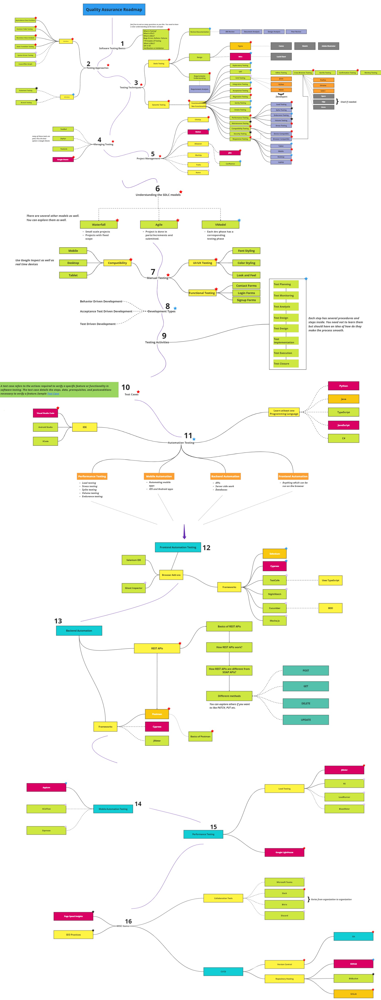

# QA-RoadMap
Discover the ultimate roadmap to becoming a rockstar QA Engineer! 🚀🔍

## Contributors
- Hammad Rashid

## Table of Contents
- [Introduction](#introduction)
- [Key](#key)
- [RoadMap](#roadmap)
- [Documentation](#documentation)
- [Articles](#articles)
- [Advice](#advice)

## 🙌Introduction
Welcome to the ultimate QA roadmap, your comprehensive guide to mastering the art and science of Quality Assurance! Whether you're a budding QA enthusiast or an experienced tester aiming to sharpen your skills, this roadmap is designed to equip you with the knowledge, tools, and best practices needed to excel in the dynamic field of QA. Embark on this journey with us, and discover the path to becoming a top-tier QA Engineer, ready to tackle any challenge with confidence and expertise. Let's dive in and make quality our top priority!

## 🔑Key
To view the key, refer here.
[Key](https://github.com/HammadRashid1997/QA-RoadMap/blob/main/images/Key.jpg)

## 🚡RoadMap

## 🗞️Documentation
You can view the complete documentation of the RoadMap here.
[Roadmap to become a QA Engineer](https://github.com/HammadRashid1997/QA-RoadMap/blob/main/roadmap.pdf)

## 🖋️Articles
I have been writing blogs and articles on various QA topics and techniques. You can read my work on Medium. 
Here is the link to my articles: [My Articles](https://medium.com/@hammad.rashid_73904)

## 🧔Advice

Here are a few suggestions for those who wish to excel in this field.

- Stay consistent and persistent while learning.
- Never ever skip any step thinking it is not important. Every step carries its own importance and is equally important while learning.
- Do no engage yourself in learning multiple items simultaneously. This will lead to a havoc and you might end up losing interest in SQA 😔
- Always remember, "Slow and steady wins the race." Utilize your time in understanding the concepts instead of completing the journey.
- Try to explore new things during your learning phase. Try to think out of the box and learn new things. You can always use Google, ChatGPT or even manuals and books to learn anything you want.

### Remember this is not the end. Always strive hard to learn more and you will succeed always. Happy Learning!
