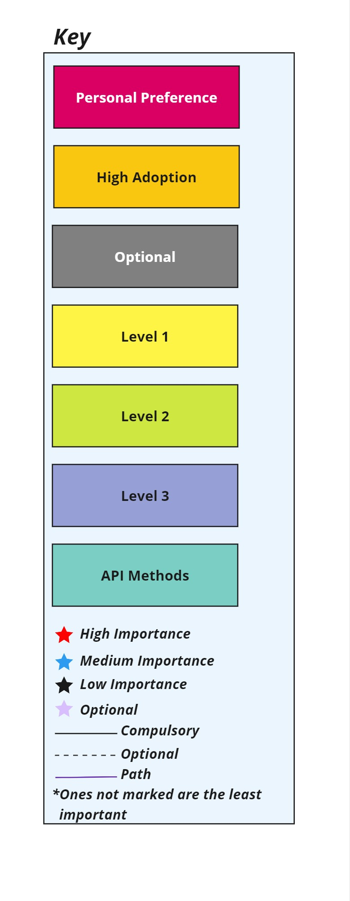

# QA-RoadMap
Discover the ultimate roadmap to becoming a rockstar QA Engineer! 🚀🔍

## Table of Contents
- [Introduction](#introduction)
- [Key](#key)
- [RoadMap](#roadmap)
- [Documentation](#documentation)
- [Advice](#advice)

## 🙌Introduction
Welcome to the ultimate QA roadmap, your comprehensive guide to mastering the art and science of Quality Assurance! Whether you're a budding QA enthusiast or an experienced tester aiming to sharpen your skills, this roadmap is designed to equip you with the knowledge, tools, and best practices needed to excel in the dynamic field of QA. Embark on this journey with us, and discover the path to becoming a top-tier QA Engineer, ready to tackle any challenge with confidence and expertise. Let's dive in and make quality our top priority!

## 🔑Key

## 🚡RoadMap

## 🧔Advice

Here are a few suggestions for those who wish to excel in this field.

- Never ever skip any step thinking this is not important for me. Every step carries its own importance and is equally important while learning.
- Do no engage yourself in learning multiple steps simultaneously. This will lead to a havoc and you might end up losing interest in SQA 😔
- Always remember, "Slow and steady wins the race." Utilize your time in understanding the concepts instead of completing the journey.
- Stay consistent and persistent while learning.
- Try to explore new things during your learning phase. Try to think out of the box and learn new things.
